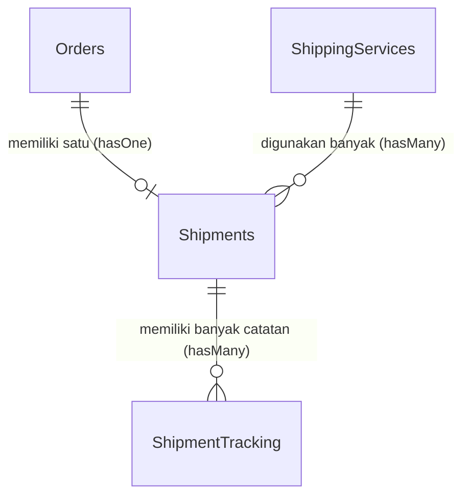

# Laporan Audit dan Perbaikan Relasi Model Eloquent

Dokumen ini berisi hasil peninjauan (audit) seluruh relasi model Eloquent pada proyek **BUMDESMart** berdasarkan panduan resmi di [cara_membuat_relasi_model.md](file:///c:/xampp/htdocs/BUMDESMart/cara_membuat_relasi_model.md).

Seluruh perubahan dan perbaikan di bawah ini **telah berhasil diterapkan** pada berkas-berkas model terkait di dalam direktori `app/Models/`.

---

## 1. Diagram Relasi (Khusus Pengiriman / Shipments)

Berikut adalah visualisasi hubungan antara model `Orders`, `Shipments`, `ShippingServices`, dan `ShipmentTracking` setelah diperbaiki:

---

## 2. Rincian Perbaikan Bug Kritis (Critical Bugs Fixed)

Beberapa relasi sebelumnya berpotensi menyebabkan error fatal saat dijalankan (Runtime Exception / Database Error). Berikut adalah perbaikan yang telah dilakukan:

### A. Model `Shipments`
*   **Masalah:** Relasi `shippingService()` didefinisikan menggunakan `hasOne(ShippingServices::class, 'shipping_service_id')`.
*   **Dampak:** Error query SQL karena Eloquent mencari kolom `shipping_service_id` di tabel `shipping_services` (tabel parent), padahal kolom tersebut berada di tabel `shipments` (tabel child).
*   **Solusi:** Diubah menjadi `belongsTo(ShippingServices::class, 'shipping_service_id')`.

### B. Model `Orders`
*   **Masalah 1:** Relasi `orderItems()` merujuk ke kelas `OrderItems::class`. Namun, nama berkas dan nama kelas model yang ada adalah `OrdersItems` (jamak).
*   **Dampak:** Error `Class "App\Models\OrderItems" not found`.
*   **Solusi:** Diubah agar merujuk ke `OrdersItems::class`.
*   **Masalah 2:** Relasi `orderDetails()` merujuk ke `OrderDetails::class` yang tidak ada di dalam proyek.
*   **Dampak:** Error `Class "App\Models\OrderDetails" not found`.
*   **Solusi:** Dihapus karena data detail item pesanan sudah diwakili oleh `orderItems()`.

### C. Model `Products`
*   **Masalah:** Relasi `umkmProfile()` merujuk ke `UmkmProfiles::class` (jamak).
*   **Dampak:** Error `Class "App\Models\UmkmProfiles" not found` karena nama kelas yang benar adalah `UmkmProfile` (tunggal).
*   **Solusi:** Diubah agar merujuk ke `UmkmProfile::class`.

### D. Model `Wishlist`
*   **Masalah:** Relasi `customers()` menggunakan foreign key kustom `'customers_id'`.
*   **Dampak:** Error database SQL (`Column not found`) karena nama kolom yang benar sesuai migrasi adalah `customer_id`.
*   **Solusi:** Diubah menjadi `belongsTo(Customers::class, 'customer_id')` dan metodenya diganti menjadi nama tunggal `customer()`.

---

## 3. Penambahan Relasi yang Hilang (Missing Relations Added)

Untuk kelengkapan query relasional, beberapa metode relasi baru ditambahkan:

1.  **`OrdersItems`**:
    *   Menambahkan relasi `product(): BelongsTo` (menghubungkan item pesanan dengan data produk asli).
    *   Menambahkan relasi `variant(): BelongsTo` (menghubungkan item dengan varian produk jika ada).
2.  **`ProductVariants`**:
    *   Menambahkan relasi `options(): HasMany` ke model `ProductVariantsOptions` agar bisa mengambil opsi atribut detail varian.
3.  **`Wishlist`**:
    *   Menambahkan relasi `product(): BelongsTo` untuk mendapatkan detail produk yang dimasukkan ke dalam wishlist.
4.  **`Promotions`**:
    *   Menambahkan relasi `umkmProfile(): BelongsTo` karena tabel `promotions` memiliki kolom `umkm_profile_id`.
5.  **`PromotionProducts`**:
    *   Menambahkan relasi `product(): BelongsTo` dan `category(): BelongsTo` untuk mempermudah pengecekan cakupan promosi.

---

## 4. Standarisasi Penamaan dan Type Hinting (Consistency & Best Practices)

Sesuai panduan proyek, seluruh relasi kini telah menerapkan standarisasi berikut:

*   **Penerapan Type Hinting**: Return type relasi dideklarasikan secara eksplisit (seperti `: BelongsTo`, `: HasMany`, `: HasOne`) serta mengimpor *namespace* kelas relasi tersebut.
*   **Aturan Tunggal/Jamak (Singular/Plural)**:
    *   Relasi yang menghasilkan **satu objek** menggunakan nama tunggal (*singular*):
        *   `Orders::customers()` diubah menjadi `Orders::customer()`
        *   `Orders::payments()` diubah menjadi `Orders::payment()`
        *   `Orders::shipments()` diubah menjadi `Orders::shipment()`
        *   `Shipments::orders()` diubah menjadi `Shipments::order()`
        *   `ShipmentTracking::shipments()` diubah menjadi `ShipmentTracking::shipment()`
        *   `PaymentDetails::payments()` diubah menjadi `PaymentDetails::payment()`
        *   `Products::categories()` diubah menjadi `Products::category()`
        *   `PromotionProducts::promotions()` diubah menjadi `PromotionProducts::promotion()`
    *   Relasi yang menghasilkan **banyak objek** tetap menggunakan nama jamak (*plural*):
        *   `Shipments::shipmentTrackings()`
        *   `ShippingServices::shipments()`
        *   `ProductVariants::options()`

---

## 5. Ringkasan Status Relasi Model Saat Ini

| Nama Model | Nama Relasi | Jenis Relasi | Target Model | Status |
| :--- | :--- | :--- | :--- | :--- |
| **Addresses** | `customer` | `belongsTo` | `Customers` | Lengkap & Sesuai |
| **Categories** | `products`   `parent`   `childs` | `hasMany`   `belongsTo`   `hasMany` | `Products`   `Categories`   `Categories` | Lengkap & Sesuai |
| **Customers** | `user`   `orders`   `addresses`   `wishlist` | `belongsTo`   `hasMany`   `hasMany`   `hasMany` | `User`   `Orders`   `Addresses`   `Wishlist` | Lengkap & Sesuai |
| **Orders** | `customer`   `umkmProfile`   `orderHistories`   `orderItems`   `payment`   `shipment` | `belongsTo`   `belongsTo`   `hasMany`   `hasMany`   `hasOne`   `hasOne` | `Customers`   `UmkmProfile`   `OrderHistory`   `OrdersItems`   `Payments`   `Shipments` | **Selesai Diperbaiki** |
| **OrdersItems** | `order`   `product`   `variant` | `belongsTo`   `belongsTo`   `belongsTo` | `Orders`   `Products`   `ProductVariants` | **Selesai Diperbaiki** |
| **PaymentDetails** | `payment` | `belongsTo` | `Payments` | **Selesai Diperbaiki** |
| **Payments** | `order`   `paymentDetails` | `belongsTo`   `hasMany` | `Orders`   `PaymentDetails` | Lengkap & Sesuai |
| **ProductImages** | `product` | `belongsTo` | `Products` | Lengkap & Sesuai |
| **ProductVariants** | `product`   `options` | `belongsTo`   `hasMany` | `Products`   `ProductVariantsOptions` | **Selesai Diperbaiki** |
| **ProductVariantsOptions** | `productVariant` | `belongsTo` | `ProductVariants` | Lengkap & Sesuai |
| **Products** | `umkmProfile`   `category`   `images`   `variants` | `belongsTo`   `belongsTo`   `hasMany`   `hasMany` | `UmkmProfile`   `Categories`   `ProductImages`   `ProductVariants` | **Selesai Diperbaiki** |
| **PromotionProducts** | `promotion`   `product`   `category` | `belongsTo`   `belongsTo`   `belongsTo` | `Promotions`   `Products`   `Categories` | **Selesai Diperbaiki** |
| **Promotions** | `umkmProfile`   `promotionProducts` | `belongsTo`   `hasMany` | `UmkmProfile`   `PromotionProducts` | **Selesai Diperbaiki** |
| **ShipmentTracking** | `shipment` | `belongsTo` | `Shipments` | **Selesai Diperbaiki** |
| **Shipments** | `order`   `shippingService`   `shipmentTrackings` | `belongsTo`   `belongsTo`   `hasMany` | `Orders`   `ShippingServices`   `ShipmentTracking` | **Selesai Diperbaiki** |
| **ShippingServices** | `shipments` | `hasMany` | `Shipments` | **Selesai Diperbaiki** |
| **UmkmDocuments** | `umkmProfile` | `belongsTo` | `UmkmProfile` | Lengkap & Sesuai |
| **UmkmProfile** | `user`   `products`   `umkmDocuments`   `orders` | `belongsTo`   `hasMany`   `hasMany`   `hasMany` | `User`   `Products`   `UmkmDocuments`   `Orders` | Lengkap & Sesuai |
| **User** | `umkmProfile`   `customer`   `orderHistories` | `hasOne`   `hasOne`   `hasMany` | `UmkmProfile`   `Customers`   `OrderHistory` | Lengkap & Sesuai |
| **Wishlist** | `customer`   `product` | `belongsTo`   `belongsTo` | `Customers`   `Products` | **Selesai Diperbaiki** |
