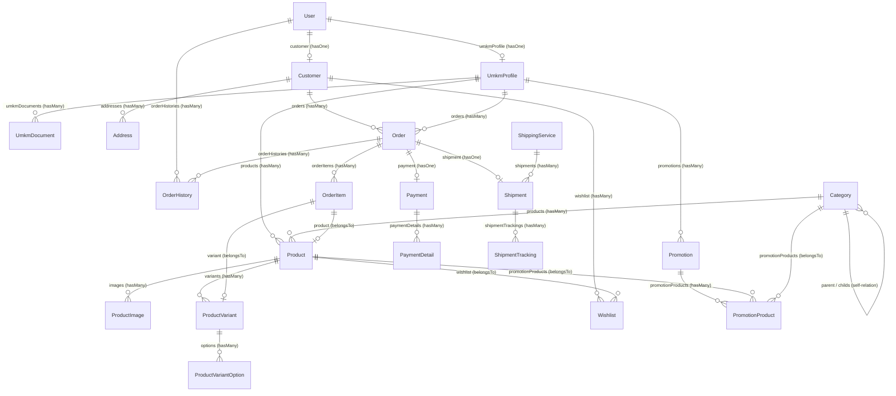
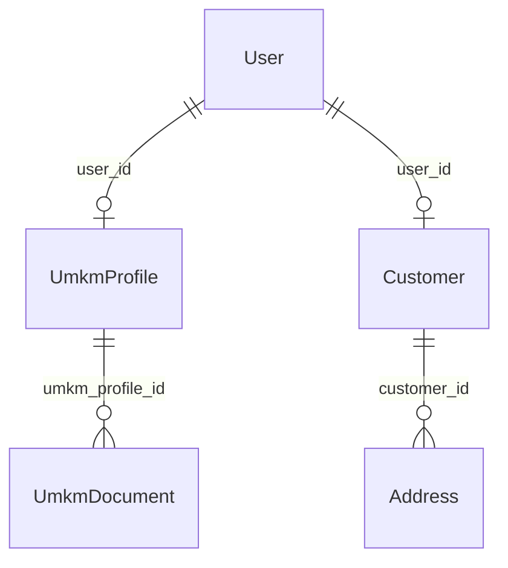
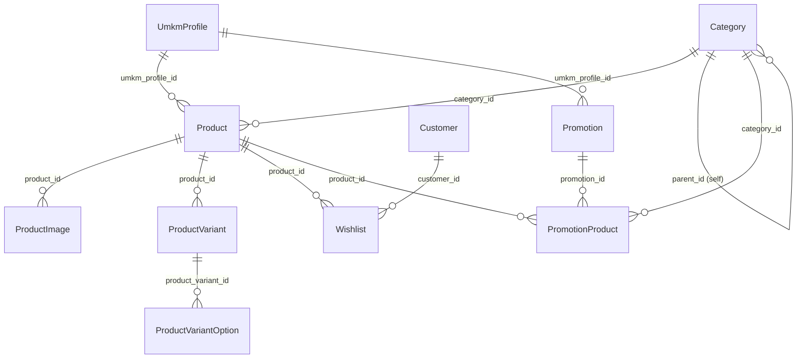
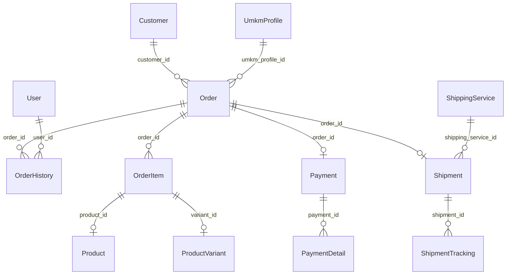

# Diagram Relasi Model BUMDESMart

Dokumen ini berisi visualisasi hubungan (Entity Relationship Diagram - ERD) dari semua model Eloquent pada proyek **BUMDESMart**. Untuk memudahkan pembacaan, diagram dibagi menjadi diagram global (keseluruhan) dan sub-diagram berdasarkan modul fungsional.

---

## 1. Diagram Relasi Global (Semua Model)

Di bawah ini adalah diagram hubungan dari ke-21 model yang ada dalam sistem:

---

## 2. Diagram Berdasarkan Modul

Karena kompleksitas diagram global di atas, berikut adalah pembagian per modul fungsional agar lebih mudah dianalisis.

### A. Modul User, Pelanggan, dan UMKM
Modul ini menangani akun pengguna, data pelanggan, alamat, profil UMKM, dan dokumen legalitas UMKM.

*   **[User](file:///c:/xampp/htdocs/BUMDESMart/backend/app/Models/User.php)**: Model utama untuk autentikasi. Memiliki relasi satu-ke-satu ke pelanggan dan profil UMKM.
*   **[Customer](file:///c:/xampp/htdocs/BUMDESMart/backend/app/Models/Customer.php)**: Menyimpan profil pembeli/pelanggan.
*   **[Address](file:///c:/xampp/htdocs/BUMDESMart/backend/app/Models/Address.php)**: Menyimpan alamat pengiriman dari pelanggan (bisa lebih dari satu).
*   **[UmkmProfile](file:///c:/xampp/htdocs/BUMDESMart/backend/app/Models/UmkmProfile.php)**: Menyimpan profil pedagang/mitra UMKM.
*   **[UmkmDocument](file:///c:/xampp/htdocs/BUMDESMart/backend/app/Models/UmkmDocument.php)**: Menyimpan berkas/dokumen verifikasi legalitas UMKM.

---

### B. Modul Katalog Produk, Stok & Promosi
Modul ini menangani klasifikasi kategori, produk, gambar produk, variasi produk (seperti ukuran/warna), serta sistem promosi/diskon.

*   **[Product](file:///c:/xampp/htdocs/BUMDESMart/backend/app/Models/Product.php)**: Model produk yang dijual oleh UMKM.
*   **[Category](file:///c:/xampp/htdocs/BUMDESMart/backend/app/Models/Category.php)**: Kategori berstruktur hierarki (self-referencing parent-child).
*   **[ProductImage](file:///c:/xampp/htdocs/BUMDESMart/backend/app/Models/ProductImage.php)**: Galeri foto produk.
*   **[ProductVariant](file:///c:/xampp/htdocs/BUMDESMart/backend/app/Models/ProductVariant.php)**: Varian produk (misal: "Baju Kaos").
*   **[ProductVariantOption](file:///c:/xampp/htdocs/BUMDESMart/backend/app/Models/ProductVariantOption.php)**: Opsi dari varian produk (misal: "Ukuran L", "Warna Merah").
*   **[Wishlist](file:///c:/xampp/htdocs/BUMDESMart/backend/app/Models/Wishlist.php)**: Menyimpan daftar produk favorit pelanggan.
*   **[Promotion](file:///c:/xampp/htdocs/BUMDESMart/backend/app/Models/Promotion.php)**: Data promosi/kupon yang dibuat oleh UMKM.
*   **[PromotionProduct](file:///c:/xampp/htdocs/BUMDESMart/backend/app/Models/PromotionProduct.php)**: Pivot untuk membatasi promosi pada produk atau kategori tertentu.

---

### C. Modul Transaksi (Order, Pembayaran & Pengiriman)
Modul inti e-commerce yang melacak pembuatan pesanan, pembayaran, serta status pengiriman ekspedisi logistik.

*   **[Order](file:///c:/xampp/htdocs/BUMDESMart/backend/app/Models/Order.php)**: Dokumen utama transaksi belanja.
*   **[OrderItem](file:///c:/xampp/htdocs/BUMDESMart/backend/app/Models/OrderItem.php)**: Detail item produk & varian yang dibeli beserta harga saat transaksi.
*   **[OrderHistory](file:///c:/xampp/htdocs/BUMDESMart/backend/app/Models/OrderHistory.php)**: Log jejak perubahan status order (dibuat, diproses, dikirim, selesai, dibatalkan) oleh User/System.
*   **[Payment](file:///c:/xampp/htdocs/BUMDESMart/backend/app/Models/Payment.php)**: Data transaksi pembayaran (gateway, nominal, status).
*   **[PaymentDetail](file:///c:/xampp/htdocs/BUMDESMart/backend/app/Models/PaymentDetail.php)**: Data tambahan/meta pembayaran (token gateway, detail instruksi bank, dll).
*   **[Shipment](file:///c:/xampp/htdocs/BUMDESMart/backend/app/Models/Shipment.php)**: Informasi pengiriman barang (no resi, ongkos kirim, status pengiriman).
*   **[ShippingService](file:///c:/xampp/htdocs/BUMDESMart/backend/app/Models/ShippingService.php)**: Daftar pilihan kurir/layanan ekspedisi pengiriman.
*   **[ShipmentTracking](file:///c:/xampp/htdocs/BUMDESMart/backend/app/Models/ShipmentTracking.php)**: Log detail pelacakan posisi paket (milestone tracking resi).

---

## 3. Rincian Hubungan & Kunci Asing (Foreign Keys)

Berikut adalah daftar detail relasi antar model beserta nama fungsi relasi, tipe relasi, target model, dan foreign key yang digunakan:

| No | Model Asal (Source) | Nama Fungsi Relasi | Tipe Relasi | Model Target | Foreign Key | Deskripsi |
|---|---|---|---|---|---|---|
| 1 | **[Address](file:///c:/xampp/htdocs/BUMDESMart/backend/app/Models/Address.php)** | `customer` | `belongsTo` | `Customer` | `customer_id` | Alamat dimiliki oleh satu pelanggan |
| 2 | **[Category](file:///c:/xampp/htdocs/BUMDESMart/backend/app/Models/Category.php)** | `products` | `hasMany` | `Product` | `category_id` | Satu kategori bisa memiliki banyak produk |
| | | `parent` | `belongsTo` | `Category` | `parent_id` | Menunjuk ke kategori induk (hirarki atas) |
| | | `childs` | `hasMany` | `Category` | `parent_id` | Mendapatkan semua sub-kategori di bawahnya |
| 3 | **[Customer](file:///c:/xampp/htdocs/BUMDESMart/backend/app/Models/Customer.php)** | `user` | `belongsTo` | `User` | `user_id` | Akun user yang terhubung dengan pelanggan |
| | | `orders` | `hasMany` | `Order` | `customer_id` | Riwayat pesanan milik pelanggan |
| | | `addresses` | `hasMany` | `Address` | `customer_id` | Daftar alamat pengiriman milik pelanggan |
| | | `wishlist` | `hasMany` | `Wishlist` | `customer_id` | Daftar item produk favorit pelanggan |
| 4 | **[OrderHistory](file:///c:/xampp/htdocs/BUMDESMart/backend/app/Models/OrderHistory.php)** | `order` | `belongsTo` | `Order` | `order_id` | Log riwayat merujuk ke satu order |
| | | `user` | `belongsTo` | `User` | `user_id` | User/aktor yang memicu perubahan status order |
| 5 | **[Order](file:///c:/xampp/htdocs/BUMDESMart/backend/app/Models/Order.php)** | `customer` | `belongsTo` | `Customer` | `customer_id` | Pelanggan yang membuat pesanan |
| | | `umkmProfile` | `belongsTo` | `UmkmProfile` | `umkm_profile_id` | UMKM yang menjual produk dalam pesanan ini |
| | | `orderHistories` | `hasMany` | `OrderHistory` | `order_id` | Riwayat perubahan status pesanan ini |
| | | `orderItems` | `hasMany` | `OrderItem` | `order_id` | Daftar item produk yang dibeli |
| | | `payment` | `hasOne` | `Payment` | `order_id` | Informasi pembayaran pesanan ini |
| | | `shipment` | `hasOne` | `Shipment` | `order_id` | Informasi pengiriman barang |
| 6 | **[OrderItem](file:///c:/xampp/htdocs/BUMDESMart/backend/app/Models/OrderItem.php)** | `order` | `belongsTo` | `Order` | `order_id` | Pesanan induk dari item ini |
| | | `product` | `belongsTo` | `Product` | `product_id` | Produk asli yang dibeli |
| | | `variant` | `belongsTo` | `ProductVariant` | `variant_id` | Varian produk spesifik (jika ada) |
| 7 | **[PaymentDetail](file:///c:/xampp/htdocs/BUMDESMart/backend/app/Models/PaymentDetail.php)** | `payment` | `belongsTo` | `Payment` | `payment_id` | Data pembayaran induk dari detail/meta ini |
| 8 | **[Payment](file:///c:/xampp/htdocs/BUMDESMart/backend/app/Models/Payment.php)** | `order` | `belongsTo` | `Order` | `order_id` | Pesanan terkait pembayaran ini |
| | | `paymentDetails` | `hasMany` | `PaymentDetail` | `payment_id` | Rincian meta transaksi pembayaran |
| 9 | **[ProductImage](file:///c:/xampp/htdocs/BUMDESMart/backend/app/Models/ProductImage.php)** | `product` | `belongsTo` | `Product` | `product_id` | Produk pemilik gambar |
| 10 | **[ProductVariant](file:///c:/xampp/htdocs/BUMDESMart/backend/app/Models/ProductVariant.php)** | `product` | `belongsTo` | `Product` | `product_id` | Produk induk dari varian ini |
| | | `options` | `hasMany` | `ProductVariantOption` | `product_variant_id` | Detail pilihan opsi dari varian ini |
| 11 | **[ProductVariantOption](file:///c:/xampp/htdocs/BUMDESMart/backend/app/Models/ProductVariantOption.php)** | `productVariant` | `belongsTo` | `ProductVariant` | `product_variant_id` | Varian induk dari opsi ini |
| 12 | **[Product](file:///c:/xampp/htdocs/BUMDESMart/backend/app/Models/Product.php)** | `umkmProfile` | `belongsTo` | `UmkmProfile` | `umkm_profile_id` | UMKM pemilik produk ini |
| | | `category` | `belongsTo` | `Category` | `category_id` | Kategori tempat produk ini berada |
| | | `images` | `hasMany` | `ProductImage` | `product_id` | Daftar gambar/foto dari produk ini |
| | | `variants` | `hasMany` | `ProductVariant` | `product_id` | Daftar varian model dari produk ini |
| 13 | **[PromotionProduct](file:///c:/xampp/htdocs/BUMDESMart/backend/app/Models/PromotionProduct.php)** | `promotion` | `belongsTo` | `Promotion` | `promotion_id` | Promosi induk terkait |
| | | `product` | `belongsTo` | `Product` | `product_id` | Produk spesifik yang dikenakan promosi |
| | | `category` | `belongsTo` | `Category` | `category_id` | Kategori spesifik yang dikenakan promosi |
| 14 | **[Promotion](file:///c:/xampp/htdocs/BUMDESMart/backend/app/Models/Promotion.php)** | `umkmProfile` | `belongsTo` | `UmkmProfile` | `umkm_profile_id` | Profil UMKM pembuat kupon promosi |
| | | `promotionProducts` | `hasMany` | `PromotionProduct` | `promotion_id` | Daftar produk/kategori khusus promo ini |
| 15 | **[ShipmentTracking](file:///c:/xampp/htdocs/BUMDESMart/backend/app/Models/ShipmentTracking.php)** | `shipment` | `belongsTo` | `Shipment` | `shipment_id` | Pengiriman induk terkait tracking |
| 16 | **[Shipment](file:///c:/xampp/htdocs/BUMDESMart/backend/app/Models/Shipment.php)** | `order` | `belongsTo` | `Order` | `order_id` | Pesanan terkait pengiriman ini |
| | | `shippingService` | `belongsTo` | `ShippingService` | `shipping_service_id` | Layanan ekspedisi kurir yang digunakan |
| | | `shipmentTrackings` | `hasMany` | `ShipmentTracking` | `shipment_id` | Catatan/log perjalanan resi |
| 17 | **[ShippingService](file:///c:/xampp/htdocs/BUMDESMart/backend/app/Models/ShippingService.php)** | `shipments` | `hasMany` | `Shipment` | `shipping_service_id` | Daftar pengiriman yang memakai layanan ini |
| 18 | **[UmkmDocument](file:///c:/xampp/htdocs/BUMDESMart/backend/app/Models/UmkmDocument.php)** | `umkmProfile` | `belongsTo` | `UmkmProfile` | `umkm_profile_id` | Profil UMKM pemilik berkas dokumen |
| 19 | **[UmkmProfile](file:///c:/xampp/htdocs/BUMDESMart/backend/app/Models/UmkmProfile.php)** | `user` | `belongsTo` | `User` | `user_id` | Akun user terdaftar pemilik UMKM |
| | | `products` | `hasMany` | `Product` | `umkm_profile_id` | Daftar produk yang dijual UMKM |
| | | `umkmDocuments` | `hasMany` | `UmkmDocument` | `umkm_profile_id` | Dokumen persyaratan milik UMKM |
| | | `orders` | `hasMany` | `Order` | `umkm_profile_id` | Daftar pesanan masuk yang diproses UMKM |
| 20 | **[User](file:///c:/xampp/htdocs/BUMDESMart/backend/app/Models/User.php)** | `umkmProfile` | `hasOne` | `UmkmProfile` | `user_id` | Profil UMKM pengguna (jika berperan sebagai penjual) |
| | | `customer` | `hasOne` | `Customer` | `user_id` | Profil pelanggan pengguna (jika berperan sebagai pembeli) |
| | | `orderHistories` | `hasMany` | `OrderHistory` | `user_id` | Catatan riwayat order yang diubah oleh user ini |
| 21 | **[Wishlist](file:///c:/xampp/htdocs/BUMDESMart/backend/app/Models/Wishlist.php)** | `customer` | `belongsTo` | `Customer` | `customer_id` | Pelanggan pemilik wishlist |
| | | `product` | `belongsTo` | `Product` | `product_id` | Detail data produk yang disukai |
