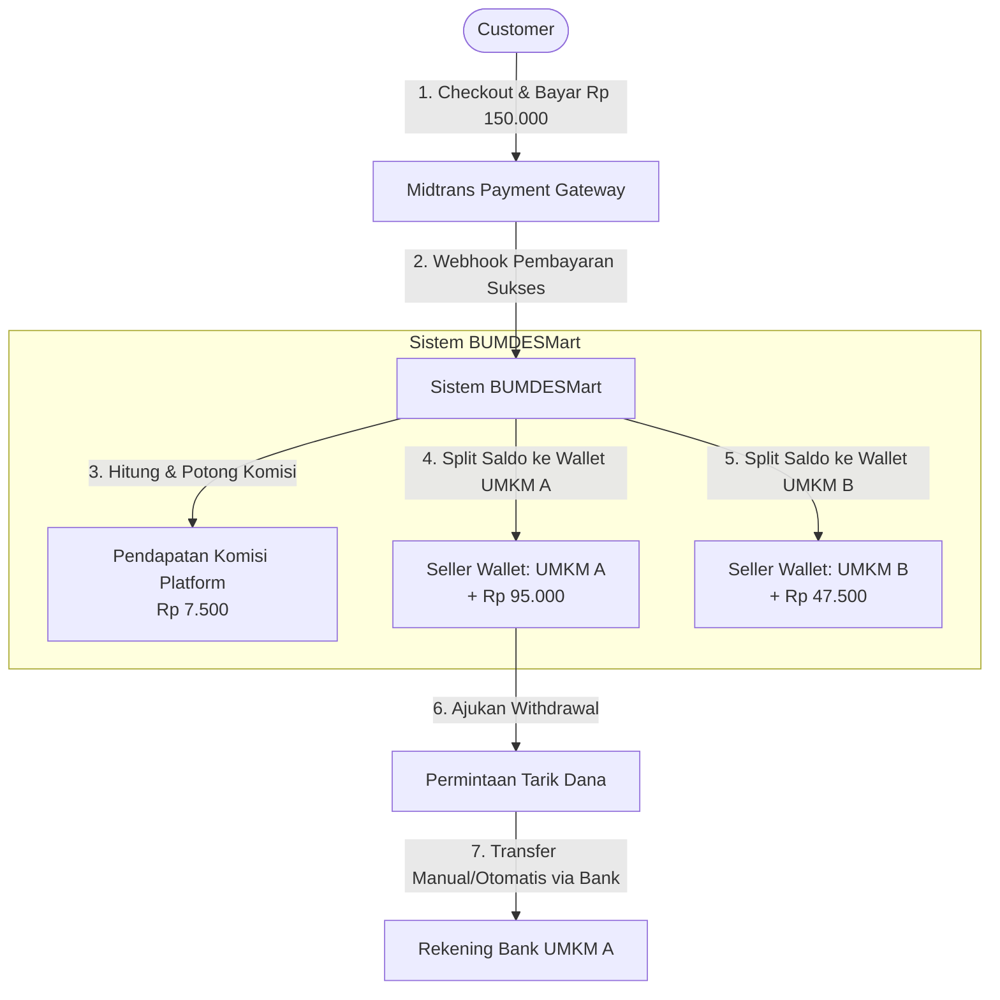
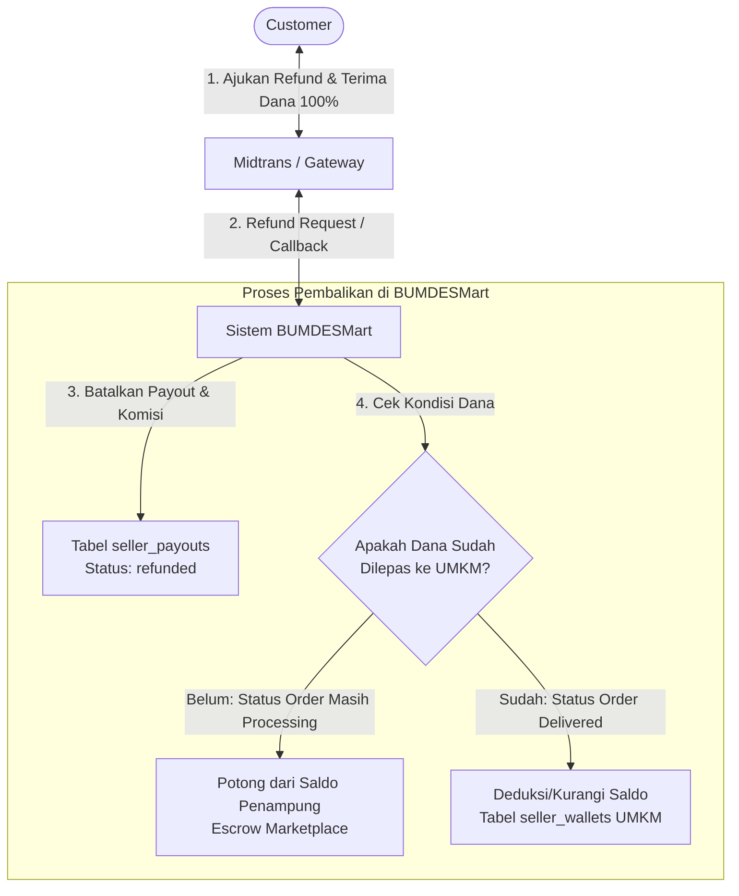

# Alur Transaksi & Skema Database Multi-Seller Marketplace (BUMDESMart)

Dokumen ini menjelaskan alur transaksi multi-seller (marketplace) menggunakan payment gateway (seperti Midtrans) beserta rancangan penambahan skema database yang dispesifikasikan khusus menggunakan tabel `umkm_profile` yang sudah ada sebagai representasi dari seller.

---

## 1. Alur Transaksi Multi-Seller

Pada model marketplace BUMDESMart, seluruh pembayaran dari customer ditampung terlebih dahulu di rekening penampung (Escrow Account) marketplace (melalui Midtrans). Setelah pesanan selesai, dana dibagi (split) ke masing-masing dompet digital (wallet) milik UMKM berdasarkan data item pesanan, setelah dikurangi komisi platform.

### Diagram Alur Transaksi & Pembagian Dana



### Simulasi Perhitungan Transaksi

*   **Pembelian Customer:**
    *   Produk dari **UMKM A**: Rp 100.000 (Potongan komisi 5% = Rp 5.000)
    *   Produk dari **UMKM B**: Rp 50.000 (Potongan komisi 5% = Rp 2.500)
    *   **Total Pembayaran Customer:** **Rp 150.000** (Masuk ke rekening Midtrans BUMDESMart)

*   **Pembagian Dana oleh Sistem:**
    *   **Saldo Wallet UMKM A** bertambah: **Rp 95.000** (Net)
    *   **Saldo Wallet UMKM B** bertambah: **Rp 47.500** (Net)
    *   **Komisi Platform** menerima: **Rp 7.500** (Pendapatan BUMDESMart)

---

## 2. Rancangan Struktur Database Baru

Berikut adalah skema tabel-tabel baru yang perlu ditambahkan. Semua tabel ini berelasi langsung dengan tabel `umkm_profile` yang bertindak sebagai entitas seller.

### A. Tabel `seller_wallets`
Menyimpan saldo berjalan milik masing-masing UMKM.
```sql
CREATE TABLE seller_wallets (
    id BIGINT PRIMARY KEY AUTO_INCREMENT,
    umkm_profile_id BIGINT NOT NULL,
    balance DECIMAL(15, 2) DEFAULT 0.00,
    created_at TIMESTAMP NOT NULL,
    updated_at TIMESTAMP NOT NULL,
    FOREIGN KEY (umkm_profile_id) REFERENCES umkm_profile(id) ON DELETE CASCADE
);
```

### B. Tabel `seller_payouts`
Mencatat detail dana masuk ke dompet UMKM per item transaksi setelah pesanan selesai/sukses.
```sql
CREATE TABLE seller_payouts (
    id BIGINT PRIMARY KEY AUTO_INCREMENT,
    order_item_id BIGINT NOT NULL,
    umkm_profile_id BIGINT NOT NULL,
    amount DECIMAL(15, 2) NOT NULL, -- Dana bersih yang diterima UMKM (setelah dipotong komisi)
    commission DECIMAL(15, 2) NOT NULL, -- Komisi platform dari item ini
    status ENUM('pending', 'released', 'refunded') DEFAULT 'pending',
    created_at TIMESTAMP NOT NULL,
    updated_at TIMESTAMP NOT NULL,
    FOREIGN KEY (order_item_id) REFERENCES order_items(id) ON DELETE CASCADE,
    FOREIGN KEY (umkm_profile_id) REFERENCES umkm_profile(id) ON DELETE CASCADE
);
```

### C. Tabel `seller_withdrawals`
Mencatat riwayat penarikan saldo dari dompet UMKM ke rekening bank pribadi milik UMKM tersebut.
```sql
CREATE TABLE seller_withdrawals (
    id BIGINT PRIMARY KEY AUTO_INCREMENT,
    umkm_profile_id BIGINT NOT NULL,
    bank_name VARCHAR(100) NOT NULL,
    account_number VARCHAR(50) NOT NULL,
    account_name VARCHAR(150) NOT NULL,
    amount DECIMAL(15, 2) NOT NULL,
    status ENUM('pending', 'approved', 'rejected', 'completed') DEFAULT 'pending',
    notes TEXT NULL,
    created_at TIMESTAMP NOT NULL,
    updated_at TIMESTAMP NOT NULL,
    FOREIGN KEY (umkm_profile_id) REFERENCES umkm_profile(id) ON DELETE CASCADE
);
```

---

## 3. Detail Alur State & Transaksi Kode

### Tahap 1: Pembayaran Midtrans (Success)
1. Customer menyelesaikan pembayaran total order (misal Rp 150.000).
2. Webhook Midtrans masuk ke sistem BUMDESMart.
3. Status tabel `payments` berubah menjadi `success`.
4. Status tabel `orders` berubah menjadi `processing`.

### Tahap 2: Pesanan Selesai (Selesai/Delivered)
Saat status pesanan diubah menjadi `delivered`/selesai (baik diklik oleh customer atau otomatis oleh sistem setelah H+X hari):
1. Sistem mengambil seluruh data `order_items` dari order terkait.
2. Untuk setiap item:
   * Hitung komisi platform berdasarkan tarif komisi (misalnya 5%).
   * Simpan detail payout ke tabel `seller_payouts` dengan status `released`.
3. Update saldo pada tabel `seller_wallets` milik `umkm_profile_id` terkait dengan menambahkan nominal `amount` bersih dari payout tersebut.

### Tahap 3: Penarikan Dana (Withdrawal)
1. UMKM mengajukan penarikan dana melalui dashboard seller.
2. Sistem mengecek kecukupan saldo berjalan di tabel `seller_wallets` milik UMKM tersebut.
3. Jika saldo mencukupi:
   * Kurangi saldo berjalan di tabel `seller_wallets`.
   * Simpan record pengajuan baru di tabel `seller_withdrawals` with status `pending`.
4. Admin platform memproses transfer dana secara manual atau otomatis melalui API Bank/Disbursement.
5. Setelah transfer berhasil, admin memperbarui status di tabel `seller_withdrawals` menjadi `completed`.

---

## 4. Alur Refund & Pengembalian Dana (Cancellation)

Jika terjadi pembatalan pesanan atau pengembalian barang yang disetujui, maka sistem harus melakukan proses *reverse transaction* (pembalikan transaksi).

### Diagram Alur Refund



### Tanya Jawab Terkait Refund & Komisi

> [!IMPORTANT]
> **Q: Apakah komisi yang terpotong akan balik juga ke user (customer)?**  
> **A: Ya, Customer menerima dana kembali 100% UTUH.**
> *   **Penjelasan:** Komisi platform **tidak dibebankan sebagai biaya tambahan di luar harga produk kepada customer**, melainkan **dipotong dari margin pendapatan UMKM (seller)**.
> *   *Contoh:* Produk UMKM A seharga Rp 100.000. Customer membayar Rp 100.000. Komisi platform (misal 5% = Rp 5.000) dipotong dari sisi UMKM, sehingga UMKM hanya mendapat Rp 95.000 bersih.
> *   Ketika terjadi **refund penuh**:
>     1. Customer menerima pengembalian penuh **Rp 100.000** (melalui Midtrans).
>     2. Platform **membatalkan komisi Rp 5.000** (pendapatan komisi platform menjadi Rp 0).
>     3. UMKM **tidak menerima dana bersih Rp 95.000** (jika saldo terlanjur dilepas ke dompet UMKM, maka saldo dompet UMKM tersebut akan didebit/dikurangi sebesar Rp 95.000).
>     4. Status transaksi pada tabel `seller_payouts` diubah menjadi `refunded`.
